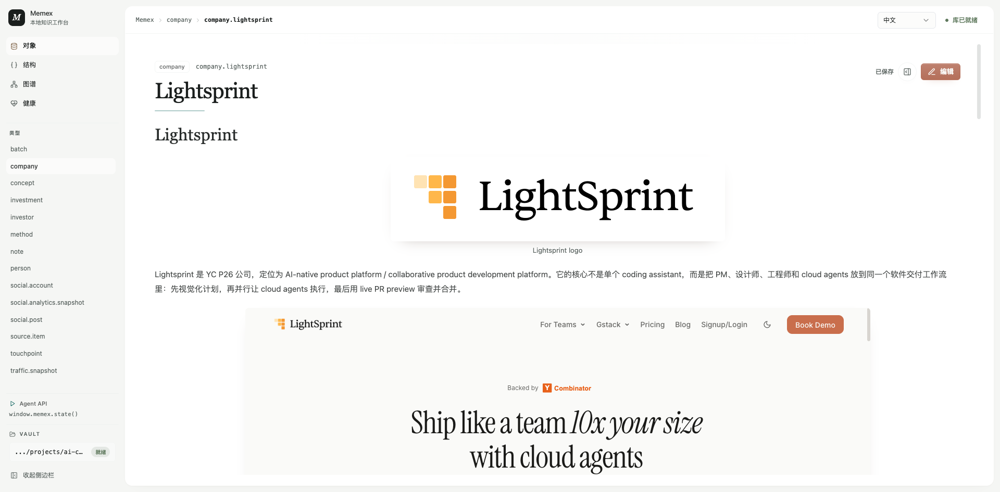
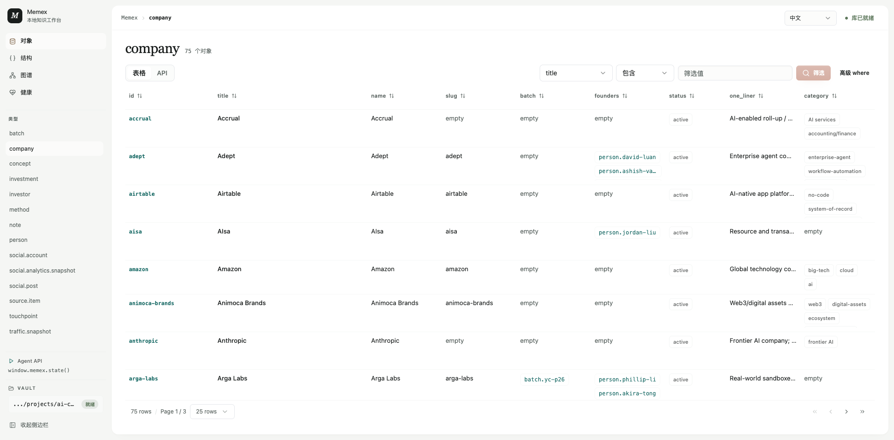
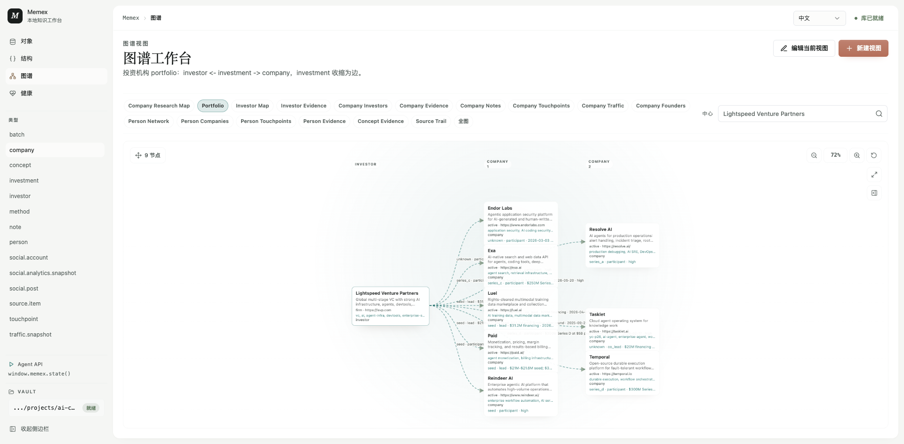

# Memex

> **构建人与 Agent 共享的世界模型，同时不放弃 Markdown。**

**一个本地优先、具备类型系统，服务于人与 Agent 的知识工作空间。**

[English](README.md) · **简体中文**

Memex 让人和 Agent 在同一个地方共同建设可以长期维护的知识。

人可以在 Web UI 或自己的编辑器中阅读、编写完整的 Markdown；Agent 可以通过确定性的 CLI 和 JSON API 创建、查询、连接并检查同一套知识。Schema 让知识可以被查询，Link 让概念可以被复用，Markdown 则保留了表达的完整性与开放性。

> **Schema 说明一个事物是什么，Link 把它放进模型，Markdown 解释它为什么重要。**

[为什么需要 Memex](#为什么需要-memex) · [核心模型](#核心模型) · [快速开始](#快速开始) · [完整文档](#完整文档)

## Memex 是什么

Memex 是一个本地优先的知识系统。在 Memex 中，每个事物都可以被建模为带类型的 Object，每个稳定关系都可以被明确表达，每个 Object 也都可以拥有一篇 Markdown Body，用于承载叙事和上下文。

一个 Company 可以连接它的 Founder 与 Source；一篇研究 Note 可以连接支撑判断的 Evidence；一个 Investor 可以通过 Investment 查看 Portfolio，同时在视图中隐藏不需要直接展示的中间记录。同一个 Vault 可以表现为 Table、Object Page，也可以表现为针对特定问题设计的 Graph。

Memex 不只是一个生成 Markdown 页面的文件夹，也不是一个要求所有知识都进入行列的数据库。它让结构化事实和长篇理解分别保留在适合它们的形态中，同时共享同一套身份与关系模型。

Memex 这个名字来自 Vannevar Bush 提出的 Memex：一个通过存储知识与联想路径来延伸人的记忆的系统。这个项目希望让这一思想在人与 Agent 共同维护知识空间的时代真正可用。

```text
人  <->  Web UI / Markdown 编辑器
                  |
            Memex Vault
       Objects + Links + Bodies
                  |
Agent  <->  CLI / JSON API / 文件
```

## 现在可以做什么

- **为领域建模：** 定义 Type 与带类型的 Field，包括 enum、list、date、URL、ref 和 ref_list。
- **操作对象：** 通过 CLI 或 Web UI 创建、更新、查询、连接、删除和检查 Object。
- **编写真正的文档：** 每个 Object 都可以拥有支持表格、图片、图表、代码、脚注和 `[[object.id]]` 双链的 Markdown Body。
- **分离事实与叙事：** 可查询的属性进入 SQLite，解释、证据和判断保留在 Markdown 中。
- **使用多种视图：** 将同一个 Vault 浏览为 Table、Object Page、Backlink 和可交互 Graph。
- **配置 Graph 投影：** 在可纳入 Git 的 JSON 文件中定义查询路径、Node 展示方式和 Bridge 收缩规则。
- **让 Agent 自动化操作：** 请求稳定的 JSON 字段，使用 `--jq` 过滤结果，调用本地 API，或通过 `window.memex` 操作 Web UI。
- **持续检查完整性：** 在提交 Vault 前发现非法 Field、断开的引用、未刷新的 Body Link 等问题。

## 产品界面

### 阅读和编辑丰富的对象页面

对象页面把结构化身份、Markdown 正文、图片、关系和编辑能力组织在同一个阅读界面里。



### 把同一份知识查询为表格

Type 可以直接呈现为聚焦、可筛选的表格，不需要复制出第二份数据。



### 将关系投影为专用图谱

Graph View 把可复用的路径查询变成可导航的投影。这里的 Portfolio View 将 Investment Object 收缩为 Investor 与 Company 之间带信息的边。



## 适合谁

### 用模型思考的人

Memex 适合不希望知识一直停留为一堆页面的人。概念、公司、人物、证据、决策、项目或者任何领域对象，都应该拥有清晰的身份、可以复用的 Schema 和明确的关系。

### 与 Agent 共同工作的人

Agent 需要的不只是从长文中检索片段。它们需要稳定 ID、可以发现的 Schema、精确查询、可预测写入和机器可读结果。人仍然需要上下文、视觉阅读、自由写作以及直接编辑文件的能力。Memex 让双方操作同一套底层 Object，但不强迫双方使用同一种界面。

## 为什么需要 Memex

### Markdown 很开放，但语义并不充分

Markdown 持久、可移植，也方便人和 Agent 编辑。但仅有一个 Markdown 文件夹，无法回答最基本的建模问题：

- 这篇 Page 是 Company、Source、Person 还是 Decision？
- 哪些 Field 合法、必填或者可以查询？
- 一个 Link 表示所有权、证据、作者关系、投资关系，还是正文中的顺带提及？
- 如何从同一套内容稳定地生成 Table 或 Graph？

### 数据库可以查询，但也不够

数据库擅长处理身份、约束、关系和筛选，却不适合承载持续演化的解释、研究报告、截图、代码示例和编辑结构。把整个 Object 都放进 JSON 或 SQL，会让写作变得不自然，也会削弱直接使用文件的价值。

因此，Memex 使用两种互补的形态：

| 形态 | 负责什么 | 最适合什么 |
|---|---|---|
| SQLite | 身份、Type、Field、Link、时间戳和完整性 | 查询、约束、自动化和视图 |
| Markdown | 叙事 Body 与嵌入媒体 | 阅读、写作、证据和解释 |

两者都不是对方的缓存。它们共同组成一个完整的 Object。

### 人和 Agent 需要共享契约

Web UI 针对阅读、编辑、筛选和视觉探索优化；CLI 针对精确操作和 Agent 工作流优化。两者使用同一个应用 Runner 与同一个 Vault，因此从任何一个界面写入的变化，都会成为另一方所看到的同一模型的一部分。

> **人通过 Page 塑造理解，Agent 通过 Object 操作模型。**

## 核心模型

| 概念 | 含义 |
|---|---|
| **Vault** | 一个本地 Memex 工作空间，包含数据库、Bodies、Assets 与视图配置。 |
| **Type** | 一类 Object 的 Schema 与关系能力。 |
| **Field** | 在 Type 上声明的带类型属性。 |
| **Object** | 拥有稳定 ID、Type、Title、Fields 与 Body 的实例。 |
| **Body** | Object 的 Markdown 叙事，以普通文件形式保存。 |
| **Link** | Object 之间的类型化关系或 Body 提及。 |
| **View** | 基于同一套 Object 生成的 Table、Page 或 Graph 投影。 |

### Link 的三个层次

Memex 把经常被混在一起的三种 Link 概念明确区分开：

1. **Link Definition：** Type 声明一个 `ref` 或 `ref_list` Field，以及它允许指向的 Type。
2. **Field Link：** Object 将另一个 Object ID 写入该 Field，形成稳定且有类型的关系断言。
3. **Body Link：** Markdown 中出现 `[[object.id]]` 或 `[[object.id|label]]`，记录上下文中的提及。

这一区分使 Graph 能够分开呈现建模关系和叙事关联。一个人的 `founder_of` 关系，不会和研究 Note 里顺带出现的一次提及被视为同一种关系，但两者都可以继续导航。

## 一个 Vault，不同工作方式

### 人的工作流

人通常从 Object Page 开始，阅读 Markdown Body、沿着 Link 导航、编辑正文、上传图片、筛选 Table，或者围绕当前 Object 打开 Graph。整个界面保持本地、单用户，不引入账号或云端 Workspace 模型。

### Agent 的工作流

Agent 通常先检查 Schema 和已有 Object，再用一次操作写入结构化 Field 与 Body，补充 Evidence Link，刷新 Body Mention，最后运行完整性检查：

```sh
mmx -C /path/to/vault field list company
mmx -C /path/to/vault query company --where 'title = "Example"'

cat <<'MD' | mmx -C /path/to/vault upsert company company.example \
  name="Example" \
  status=active \
  --body-stdin
# Example

Example is supported by [[source.example-home]].
MD

mmx -C /path/to/vault body refresh company.example
mmx -C /path/to/vault issues
```

直接编辑 Markdown 文件仍然受到支持。在 Memex 之外修改 Body 文件后，运行 `body refresh <id>` 或 `refresh`，让 Body Link 与本地索引和磁盘文件保持一致。

## View 是投影，不是副本

Memex 不会为每一种界面复制一套独立数据。

- **Table：** 对比同一 Type 的 Objects，对 Field 排序，并通过可视化控件构造筛选条件。
- **Object Page：** 在同一处阅读 Fields、Markdown、Links、Backlinks 和局部关系图。
- **Graph：** 探索整个 Vault，或者回答 `investor <- investment -> company` 这样的配置化问题。

Graph View 存放在 `memex.graph-views.json`。Agent 可以直接编辑这个文件、验证配置，并在不打开浏览器的情况下执行 View。Version 2 View 可以组合多条路径，选择 Node 上展示哪些 Field，还可以把中间 Object 收缩为 Derived Edge。

```sh
mmx -C /path/to/vault graph view validate
mmx -C /path/to/vault graph query \
  --view portfolio \
  --center investor.example \
  --json nodes,edges,stats
```

这个文件适合纳入 Git、代码审查、复用以及由 Agent 生成修改，并且始终是 CLI 与 Web UI 共同使用的事实源。

## 快速开始

构建 CLI：

```sh
cd /path/to/memex
go build -o mmx ./cmd/mmx
```

创建一个 Vault 和第一组相互连接的 Object：

```sh
VAULT=/tmp/memex-demo

./mmx -C "$VAULT" init
./mmx -C "$VAULT" type create concept
./mmx -C "$VAULT" field add concept title --kind text --required
./mmx -C "$VAULT" field add concept related --kind ref_list --target concept

./mmx -C "$VAULT" create concept concept.rag title="Retrieval-augmented generation"
printf '# Memex\n\nDifferent from [[concept.rag]].\n' | \
  ./mmx -C "$VAULT" create concept concept.memex title="Memex" --body-stdin
./mmx -C "$VAULT" link concept.memex related concept.rag
./mmx -C "$VAULT" body refresh concept.memex
./mmx -C "$VAULT" issues
```

启动本地 Web UI：

```sh
./mmx serve --addr 127.0.0.1:8766
```

打开 <http://127.0.0.1:8766>。如果当前目录本身不是 Vault，Memex 会自动创建并打开内置的 **Memex 功能示例**。它是一个正常、可写的 Vault，包含示例 Schema、Object、Field/Body Link、本地图片、富 Markdown 和可配置 Graph View。示例只在操作系统的用户配置目录中首次创建，之后的编辑不会被启动过程覆盖。

需要把指定 Vault 作为服务默认库时，显式传入：

```sh
./mmx -C /path/to/vault serve --addr 127.0.0.1:8766
```

Web UI 启动时会读取服务默认 Vault，并始终在 Vault 切换器里保留“Memex 功能示例”入口。打包或隔离环境也可以通过 `MEMEX_SHOWCASE_VAULT=/custom/path` 覆盖示例库位置。

## Agent 与 API 接口

CLI 默认输出适合人阅读的结果。Agent 与脚本可以请求完整结果 Envelope、选择字段，并使用内置的 `jq` 风格表达式过滤结果，不依赖系统安装的 `jq`：

```sh
mmx -C /path/to/vault get company.example --json
mmx -C /path/to/vault get company.example \
  --json object,body_abs_path,links,backlinks \
  --jq '.body_abs_path'
```

Web UI 通过 `POST /api/run` 调用同一个内部 Runner：

```json
{
  "vault": "/path/to/vault",
  "argv": ["query", "company", "--where", "status=active"]
}
```

二进制 Asset 使用独立的 multipart 接口，因为文件上传无法自然地表达为命令 JSON：

```sh
curl -F 'vault=/path/to/vault' \
  -F 'file=@./screenshot.png' \
  http://127.0.0.1:8766/api/assets
```

为了支持浏览器自动化与 UI 开发，`window.memex` 暴露导航、状态检查、Graph 操作、编辑等高层能力，Agent 不必重复模拟底层点击过程。

## 产品边界

Memex 是本地优先、单用户的产品。它目前不提供云托管、账号、权限或实时多人协作。Git 可以把 Vault 作为本地文件进行版本管理，其中 Markdown Body 与 JSON View 配置保持可直接审查；Memex 负责维护 Object 完整性与本地索引。

Memex 也不会取代通用 Markdown 编辑器，或者自动推断所有关系。哪些概念值得拥有稳定身份、哪些事实应该进入 Field、哪些关系应该被明确表达，仍然由人和 Agent 判断。自动化帮助维护模型，但模型始终可以被检查和编辑。

## 技术架构

- **Core：** Go、Cobra、`database/sql` 与 `modernc.org/sqlite`
- **Web：** React、TypeScript、Vite、Tailwind CSS、shadcn/ui primitives、TanStack 与 React Flow
- **Storage：** SQLite Object Model、Markdown Bodies 与本地 Assets
- **Interfaces：** CLI、本地 JSON API、Web UI 与 `window.memex` 浏览器自动化

Web UI 与 CLI 通过 `POST /api/run` 共享同一个内部命令 Runner。

## 开发

构建并检查前端：

```sh
cd web
npm install
npm run build
```

构建并检查 Go 应用：

```sh
go test ./...
go build ./...
```

## 完整文档

- [完整使用指南](docs/usage-guide.md)
- [Markdown 渲染实验室](docs/markdown-render-lab.md)
- [YC 建模实战笔记](docs/yc-modeling-field-notes.md)

## 项目状态

Memex 正在持续开发。Object Model、Markdown Body 工作流、CLI/API Runner、Table 与 Object View、可配置 Graph View 以及本地 Web UI 均已形成可用能力。
