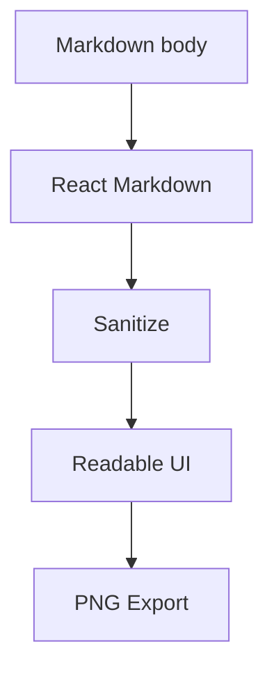

# Markdown Render Lab

This fixture is used to manually verify mbase Markdown rendering. It mirrors the body used in `/tmp/mbase-yc-model` as `note.markdown-render-lab`.

这是一份用于检查 mbase Markdown 渲染的综合样本。它故意把 **结构化笔记**、[[company.lightsprint|对象双链]]、外部链接、内联代码 `mbase get note.markdown-render-lab`、<mark>高亮文字</mark>、<ins>新增观点</ins> 和 ~~废弃口径~~ 放在同一篇正文里。

## 1. 段落与语义层级

第一段应该是正常阅读节奏，不应该被卡片化，也不应该显得像后台配置页。中文、English terms, numbers 123, and inline code should flow naturally.

第二段用于检查连续段落的距离。这里有一个脚注引用[^model-note]，还有 H~2~O 和 E=mc^2^ 这种上下标场景。

---

## 2. 多级列表

- 顶层 bullet：研究对象是 company。
  - 第二层：company 可以链接 touchpoint、source.item、note。
    - 第三层：source.item 负责证据，不承载最终判断。
      - 第四层：如果继续嵌套，marker 仍应可读，缩进不能失控。
  - 第二层另一个分支，里面包含段落。

    这是列表项中的第二段。它应该跟上一行归属同一个列表项，而不是看起来像新的正文块。

    > 列表项中的引用：用于记录一个局部判断。
    >
    > - 引用里也可以有列表。
    > - 第二条引用列表。

- 顶层第二项：下面跟一个代码块。

  ```ts
  type Link = {
    from: string;
    to: string;
    kind: "field" | "body";
  };
  ```

1. 有序列表第一项
2. 有序列表第二项
   1. 子序号 alpha 层
   2. 子序号第二项
      1. 第三层 roman 层
      2. 仍然需要清楚
3. 有序列表第三项

## 3. Task List

- [x] 支持 GitHub 风格任务列表
- [ ] 未完成任务要对齐文字基线
  - [x] 嵌套任务 A
  - [ ] 嵌套任务 B，文字比较长时应该换行到文本列，而不是跑到 checkbox 下方。

## 4. 表格

| 对象 | 角色 | 字段/链接 | 备注 |
| --- | --- | --- | --- |
| company | 主体 | `name`, `kind`, `tags` | 综合档案，body 放长期分析 |
| source.item | 证据 | `url`, `quality`, `capture_status` | 可以链接到 [[source.yc-launch.lightsprint]] |
| note | 人的判断 | `author`, `tags`, `source_items` | CP takeaway 不应该藏在 company body 里 |

## 5. 引用与 GitHub Alert

> 普通引用第一层。这里应该克制、温和，不要像错误提示。
>
> > 第二层引用用于保留原文里的嵌套语义。

> [!NOTE]
> 这是一条 note alert。它应该能跟普通引用区分，但不应该过重。
>
> - alert 里面可以有列表。
> - 也可以有 `inline code`。

> [!WARNING]
> 这是 warning/caution 视觉，用来表达需要注意的迁移风险。

## 6. 图片与说明


<figure>
  
  <figcaption>Figure: 产品工作流截图，检查 HTML figure/figcaption、图片圆角、说明文字和正文间距。</figcaption>
</figure>

## 7. Details 与键盘符号

<details open>
<summary>展开的设计决策</summary>

- 使用 <kbd>Cmd</kbd> + <kbd>K</kbd> 打开命令面板。
- 使用 `body refresh` 重新抽取双链。
- details 内的列表、段落和代码块都应该保持阅读宽度。

```bash
mbase -C /tmp/mbase-yc-model get note.markdown-render-lab
mbase -C /tmp/mbase-yc-model body refresh note.markdown-render-lab
```
</details>

## 8. 长代码与 Mermaid



```json
{
  "object": "note.markdown-render-lab",
  "nested": { "list": true, "table": true, "media": true },
  "links": ["company.lightsprint", "source.yc-launch.lightsprint"]
}
```

[^model-note]: 脚注用于补充模型解释，不应该打断正文阅读。
