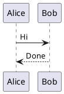

# mbase 使用指南

`mbase` 是一个 local-first 的对象图谱知识库。它把结构化对象存在 SQLite，把长正文、研究记录、证据说明存在 Markdown 文件里。人可以在 Web UI 阅读和编辑，agent 可以用 CLI/API 稳定创建、查询和更新。

## 1. 核心概念

- `Vault`：一个 mbase 知识库目录。目录里有 `.mbase/mbase.db`、`bodies/`、`assets/`，也可以放 `mbase.graph-views.json`。
- `Type`：对象类型，例如 `company`、`person`、`source.item`、`note`、`concept`。
- `Field`：type 上的字段。字段可以是普通属性，也可以是关系字段。
- `Object`：某个 type 的实例，例如 `company.lightsprint`。
- `Body`：对象的 Markdown 正文，适合写档案、证据、分析和人的判断。
- `Field link`：由 `ref` / `ref_list` 字段产生的强关系。
- `Body link`：Markdown 里的 `[[object.id]]` 产生的弱提及关系。
- `Graph view`：基于对象和 links 的图谱视图，可以全局看，也可以用配置视图看局部路径。

基本心智是：**SQLite 管 schema 和对象字段，Markdown 管长正文，links 把对象网络连起来。**

## 2. 安装和启动

当前系统默认使用 `/tmp/mbase`：

```bash
/tmp/mbase --help
```

如果在源码目录开发：

```bash
cd /Users/cp/workspace/assistant/system/tools/mbase
go build -o /tmp/mbase ./cmd/mbase
```

启动 Web UI：

```bash
/tmp/mbase serve --addr 127.0.0.1:8766
```

打开：

```text
http://127.0.0.1:8766
```

Web UI 可以用 URL 参数指定 vault：

```text
http://127.0.0.1:8766/?vault=%2Fpath%2Fto%2Fvault
```

多个浏览器窗口可以打开不同 vault。关键上下文在 URL 的 `vault=` 参数里，`localStorage` 只用于 recent/default。

## 3. 创建和检查 Vault

创建新 vault：

```bash
VAULT=/path/to/my-vault
/tmp/mbase -C "$VAULT" init
```

检查 vault：

```bash
/tmp/mbase -C "$VAULT" vault info
/tmp/mbase -C "$VAULT" status
/tmp/mbase -C "$VAULT" issues
/tmp/mbase -C "$VAULT" doctor
```

常用约定：

- 命令里始终带 `-C "$VAULT"`，避免跑错库。
- `issues` 返回 `count: 0` 才表示结构关系健康。
- 手动改 Markdown 后运行 `body refresh` 或 `refresh`，让 `[[object.id]]` 重新抽取成 body links。

## 4. 设计 Schema

先创建 type：

```bash
/tmp/mbase -C "$VAULT" type create company
/tmp/mbase -C "$VAULT" type create person
/tmp/mbase -C "$VAULT" type create source.item
```

查看 type：

```bash
/tmp/mbase -C "$VAULT" type list
/tmp/mbase -C "$VAULT" type show company
/tmp/mbase -C "$VAULT" field list company
/tmp/mbase -C "$VAULT" field list company --json
```

日常人读优先用 `field list <type>`，它会用表格展示字段名、kind、target、required、unique 和 enum values。窄终端下长 values 会截断；需要完整 enum values 或精确结构时，用 `field list <type> --json` 或 `type show <type>`。

添加字段：

```bash
/tmp/mbase -C "$VAULT" field add company name --kind text --required
/tmp/mbase -C "$VAULT" field add company status --kind enum --values active,archived,ignored
/tmp/mbase -C "$VAULT" field add company tags --kind list
/tmp/mbase -C "$VAULT" field add company website --kind url
/tmp/mbase -C "$VAULT" field add company founders --kind ref_list --target person
/tmp/mbase -C "$VAULT" field add source.item about_company --kind ref --target company
```

字段类型：

| kind | 用途 | 输入 |
| --- | --- | --- |
| `text` | 字符串 | `name=Lightsprint` |
| `number` | 数字 | `score=0.8` |
| `boolean` | 布尔 | `active=true` |
| `date` | 日期/时间字符串 | `captured_at="2026-07-10 10:30:00"` |
| `url` | URL 字符串 | `website=https://example.com` |
| `enum` | 枚举 | 需要 `--values a,b,c` |
| `list` | 字符串数组 | `tags=ai,devtool` |
| `ref` | 指向一个对象 | 需要 `--target <type>` |
| `ref_list` | 指向多个对象 | 需要 `--target <type>` |
| `json` | JSON 风格字段 | 用于后续扩展 |

关系建模建议：

- 稳定、强语义关系放 `ref` / `ref_list` 字段。
- 正文里自然提到的对象放 `[[object.id]]`。
- 不要把所有关系都塞进 Markdown。需要查询、过滤、图谱路径的关系应建字段。

## 5. 创建对象

推荐日常命令：

```bash
/tmp/mbase -C "$VAULT" create company company.lightsprint \
  name=Lightsprint \
  title=Lightsprint \
  status=active \
  tags=agentic-sdlc,demo-led \
  website=https://lightsprint.com
```

创建时同时写 body：

```bash
cat <<'EOF' | /tmp/mbase -C "$VAULT" create company company.lightsprint \
  name=Lightsprint title=Lightsprint status=active --body-stdin
# Lightsprint

Lightsprint is linked to [[concept.agentic-sdlc]].
EOF
```

从文件写 body：

```bash
/tmp/mbase -C "$VAULT" create note note.product-takeaway \
  title="Product takeaway" \
  --body ./note.product-takeaway.md
```

create 与 upsert：

- `create`：对象已存在会失败。
- `upsert`：对象不存在就创建，存在就更新字段，适合 agent 重复写入。

```bash
/tmp/mbase -C "$VAULT" upsert company company.lightsprint \
  name=Lightsprint status=active
```

删除对象：

```bash
/tmp/mbase -C "$VAULT" delete company.lightsprint --yes
```

删除只移除 SQLite 对象和关系，Markdown body 文件会保留在磁盘上，避免误删正文。

## 6. 读取和更新对象

读取对象详情：

```bash
/tmp/mbase -C "$VAULT" get company.lightsprint
```

不返回完整 body，适合 agent 节省 token：

```bash
/tmp/mbase -C "$VAULT" get company.lightsprint --no-body
/tmp/mbase -C "$VAULT" get company.lightsprint --body-preview 800
```

设置普通字段：

```bash
/tmp/mbase -C "$VAULT" set company.lightsprint status active
/tmp/mbase -C "$VAULT" set company.lightsprint tags agentic-sdlc,demo-led
```

设置关系字段：

```bash
/tmp/mbase -C "$VAULT" link company.lightsprint founders person.alice
/tmp/mbase -C "$VAULT" link source.launch-lightsprint about_company company.lightsprint
```

底层兼容命令仍可用：

```bash
/tmp/mbase -C "$VAULT" object create company --id company.lightsprint --field name=Lightsprint
/tmp/mbase -C "$VAULT" object get company.lightsprint
/tmp/mbase -C "$VAULT" object set company.lightsprint status active
/tmp/mbase -C "$VAULT" object link company.lightsprint founders person.alice
/tmp/mbase -C "$VAULT" object unlink company.lightsprint founders person.alice
```

日常优先用顶层 `create/get/set/link/query`，不要把心智停留在底层 `object` 子系统。

## 7. Source Item 快捷写入

`source.item` 是证据内容单元，例如文章、网页快照、tweet、YC launch、Similarweb snapshot。

如果 schema 里已有 `source.item` 和相应字段，可以用：

```bash
cat <<'EOF' | /tmp/mbase -C "$VAULT" source add source.yc-launch.lightsprint \
  --title "Lightsprint YC Launch" \
  --url "https://www.ycombinator.com/launches/..." \
  --platform yc \
  --item-type launch \
  --quality full \
  --processing-status parsed \
  --evidence-level S1 \
  --about-company company.lightsprint \
  --body-stdin
# Lightsprint YC Launch

Evidence summary and extracted details.
EOF
```

`source add` 本质是对 `source.item` 的 upsert，并内置常用 alias：

| flag | 字段 |
| --- | --- |
| `--title` | `title` |
| `--url` | `url` |
| `--platform` | `platform` |
| `--item-type` | `item_type` |
| `--author` | `author` |
| `--published-at` | `published_at` |
| `--collected-at` | `collected_at` |
| `--quality` | `quality` |
| `--processing-status` | `processing_status` |
| `--evidence-level` | `evidence_level` |
| `--summary` | `summary` |
| `--language` | `language` |
| `--capture-method` | `capture_method` |
| `--capture-status` | `capture_status` |
| `--captured-at` | `captured_at` |
| `--about-company` | `about_company` |
| `--from-touchpoint` | `from_touchpoint` |

也可以继续写任意字段：

```bash
/tmp/mbase -C "$VAULT" source add source.website.demo \
  --title "Website snapshot" \
  --field custom_field=value
```

## 8. Markdown Body

查看 body 路径：

```bash
/tmp/mbase -C "$VAULT" body path company.lightsprint
```

覆盖 body：

```bash
cat ./company.lightsprint.md | /tmp/mbase -C "$VAULT" body write company.lightsprint --stdin
```

追加 body：

```bash
cat <<'EOF' | /tmp/mbase -C "$VAULT" body append company.lightsprint --stdin

## Follow-up

New evidence from [[source.website.lightsprint]].
EOF
```

刷新 body links：

```bash
/tmp/mbase -C "$VAULT" body refresh company.lightsprint
/tmp/mbase -C "$VAULT" refresh
```

Markdown 支持：

- 标准 Markdown 标题、段落、列表、引用、代码块。
- GFM 表格、task list、脚注、删除线。
- HTML：`details`、`summary`、`kbd`、`mark`、`ins`、`figure`、`figcaption`。
- `mermaid` 代码块。
- `plantuml` / `puml` / `uml` 代码块。Web UI 通过本机 `plantuml -tsvg -pipe` 渲染 SVG；可用 `PLANTUML_BIN` 指定二进制路径。
- mbase 双链：`[[company.lightsprint]]`、`[[company.lightsprint|Lightsprint]]`。
- Obsidian 风格图片：`![[assets/demo.png]]`、`![[assets/demo.png|Product demo]]`。
- 图片 caption：`` 会显示说明文字。
- 图片布局：`{wide}`、`{full}`、`{inline}`，例如 ``。
- mbase 结构化块：`facts`、`timeline`。

`facts`：

````md
```facts
Status: Active
Category: Agentic SDLC
Evidence: YC launch, website
```
````

`timeline`：

````md
```timeline
2026-01 | YC launch captured
2026-02 | Product demo reviewed
```
````

`plantuml`：

````md

````

注意：`> [!NOTE]` 这类 GitHub Alert 不是 mbase 核心语法。

## 9. 图片和资产

导入本地图片到 vault：

```bash
/tmp/mbase -C "$VAULT" asset import ./screenshot.png --name company-demo.png
```

输出会包含可直接粘进 Markdown 的图片语法：

```text

```

Web UI 也有专门的资产上传 API：

```bash
curl -F "vault=$VAULT" -F "file=@./screenshot.png" http://127.0.0.1:8766/api/assets
```

建议：

- 对象正文里的图片放 `assets/`。
- 公司类对象至少保留：官网/定位图、产品界面或 demo 图、launch/流量/证据图。
- 图片是 body 的一部分，不要只把 URL 存在字段里。

## 10. 查询

查询某个 type：

```bash
/tmp/mbase -C "$VAULT" query company
```

选择字段：

```bash
/tmp/mbase -C "$VAULT" query company --select id,title,status,tags
```

过滤：

```bash
/tmp/mbase -C "$VAULT" query company --where status=active
/tmp/mbase -C "$VAULT" query company --where "title contains sprint"
/tmp/mbase -C "$VAULT" query company --where status!=ignored
/tmp/mbase -C "$VAULT" query source.item --where 'url = "https://example.com/a?x=1&y=2"'
```

`--where` 的值可以用单引号或双引号包起来，适合 URL、空格和 shell 特殊字符。URL 查询推荐外层单引号、值用双引号：`--where 'url = "https://...?a=1&b=2"'`，这样最不容易被 zsh 展开。

多个 `--where` 是 AND：

```bash
/tmp/mbase -C "$VAULT" query source.item \
  --where about_company=company.lightsprint \
  --where quality=full
```

排序和限制：

```bash
/tmp/mbase -C "$VAULT" query source.item \
  --select id,title,published_at \
  --sort published_at:desc \
  --limit 20
```

`ref` / `ref_list` 字段可以按对象 id 查询：

```bash
/tmp/mbase -C "$VAULT" query note --where about_company=company.lightsprint
/tmp/mbase -C "$VAULT" query social.post --where 'account = "social.account.x.yan5xu"'
/tmp/mbase -C "$VAULT" query source.item --where 'about_company = "company.skywork"'
```

关系字段查的是 object id，不是标题或显示名。`ref_list` 查询是 member match：只要列表里包含这个 object id 就会命中。

## 11. Links 和 Backlinks

看一个对象指向谁：

```bash
/tmp/mbase -C "$VAULT" links company.lightsprint
```

看谁指向这个对象：

```bash
/tmp/mbase -C "$VAULT" backlinks company.lightsprint
```

过滤：

```bash
/tmp/mbase -C "$VAULT" backlinks company.lightsprint --type source.item
/tmp/mbase -C "$VAULT" backlinks company.lightsprint --kind field
/tmp/mbase -C "$VAULT" backlinks company.lightsprint --relation about_company
/tmp/mbase -C "$VAULT" backlinks company.lightsprint --filter launch
```

link 的 `kind`：

- `field`：由 `ref` / `ref_list` 字段产生。
- `body`：由 Markdown `[[object.id]]` 产生。

## 12. Graph

导出全图：

```bash
/tmp/mbase -C "$VAULT" graph export --json
```

Web UI 的 Graph 页面可以：

- 查看全图或 schema graph。
- 选择 center object。
- 搜索 center。
- 配置 graph view。
- 过滤 type。
- 点击节点预览 Markdown。
- 双击节点切换中心。

`mbase.graph-views.json` 是 Graph View 的唯一事实源：CLI、Web UI 和 agent 都读写同一个文件，适合直接纳入 Git。现有 version 1 配置继续兼容。version 2 支持多个查询路径、节点内容模板，以及把中间对象收缩为派生边。

配置自定义 graph view：

```json
{
  "version": 2,
  "views": [
    {
      "id": "investor-portfolio",
      "label": "Investor Portfolio",
      "root_type": "investor",
      "paths": [{
        "steps": [
          { "direction": "in", "relation": "investor", "target_type": "investment", "display": "bridge" },
          { "direction": "out", "relation": "company", "target_type": "company" }
        ]
      }],
      "nodes": {
        "investor": {
          "variant": "standard",
          "title_field": "name",
          "subtitle_field": "focus"
        },
        "company": {
          "variant": "rich",
          "title_field": "name",
          "subtitle_field": "one_liner",
          "meta_fields": ["status", "batch"],
          "badge_fields": ["tags"]
        }
      },
      "bridges": {
        "investment": {
          "label_fields": ["round", "amount_text", "announced_at"],
          "aggregate": true
        }
      }
    }
  ]
}
```

推荐的 agent 工作流：

```bash
# 直接编辑 Vault 中的配置后，按动态 schema 校验 type、relation 和展示字段
/tmp/mbase -C "$VAULT" graph view validate

# 校验草稿文件，不改 Vault
/tmp/mbase -C "$VAULT" graph view validate --file ./draft-graph-views.json

# 校验通过后原子写入 Vault
/tmp/mbase -C "$VAULT" graph view apply --file ./draft-graph-views.json

# 也可以走 stdin
/tmp/mbase -C "$VAULT" graph view apply --stdin < ./draft-graph-views.json
```

查看：

```bash
/tmp/mbase -C "$VAULT" graph view list
/tmp/mbase -C "$VAULT" graph view show investor-portfolio --json
/tmp/mbase -C "$VAULT" graph view schema --json
```

不打开 Web UI，直接执行视图并检查投影结果：

```bash
/tmp/mbase -C "$VAULT" graph query \
  --view investor-portfolio \
  --center investor.lightspeed-venture-partners \
  --json

# 只读取最终节点、边和统计
/tmp/mbase -C "$VAULT" graph query --view investor-portfolio --center investor.lightspeed-venture-partners --json nodes,edges,stats

# 检查收缩产生的派生边
/tmp/mbase -C "$VAULT" graph query --view investor-portfolio --center investor.lightspeed-venture-partners --json --jq '.data.edges[] | select(.derived == true)'
```

`display: "bridge"` 只改变视图投影，不删除中间对象或底层链接。派生边会返回 `derived: true`、`via_ids`、`via` 和完整的 `relations`；同一对端点存在多条中间对象时，`aggregate: true` 会合并并保留全部来源。

节点模板使用受控字段槽位，不执行 HTML 或脚本：

- `variant`：`compact`、`standard`、`rich`。
- `title_field`：主标题字段，缺失时回退到 object title/id。
- `subtitle_field`：副标题字段。
- `meta_fields`：简短元信息。
- `badge_fields`：标签信息。
- `image_field`：预留的图片或 asset 字段。

设计 graph view 的原则：

- 不要写死业务视图到代码里，优先放 vault 配置。
- view 是“从中心对象沿字段路径看几层”，不是全图过滤器。
- Graph Query 先获得完整关系路径，再做节点模板、bridge 收缩和边聚合；底层数据始终不变。
- 大图默认用 type 过滤和局部 view，避免所有节点一屏堆出来。

## 13. Web UI

启动：

```bash
/tmp/mbase serve --addr 127.0.0.1:8766
```

主要页面：

- `Objects`：按 type 看表格，查询对象。
- `Detail`：对象字段、Markdown body、编辑正文、保存图片、打开 inspector。
- `Graph`：图谱和自定义 graph view。
- `Schema`：查看 type/field。
- `Health`：查看 issues。
- `VI`：视觉测试页面，用于组件、Markdown、控件一致性走查。

浏览器 automation：

```js
window.mbase.state()
window.mbase.uiState()
window.mbase.openObject("company.lightsprint")
window.mbase.selectType("company")
window.mbase.openGraph()
window.mbase.graphWorkspace.state()
window.mbase.graphWorkspace.reloadViews()
window.mbase.graphWorkspace.queryView("investor-portfolio", "investor.lightspeed-venture-partners")
window.mbase.graphWorkspace.previewNode("company.lightsprint")
window.mbase.graphWorkspace.configure(true)
window.mbase.graphWorkspace.setEditor({
  nodes: { company: { variant: "rich", title_field: "name", subtitle_field: "one_liner" } },
  bridges: { investment: { label_fields: ["round", "amount_text"], aggregate: true } }
})
window.mbase.graphWorkspace.selectEdge("investor.lightspeed-venture-partners", "company.luel")
window.mbase.relationGraph.state()
```

这让 agent 可以用 `browser eval` 直接操作 UI 和读取状态。

## 14. JSON、jq 和 API

CLI 默认输出给人看。加 `--json` 输出机器可读 JSON：

```bash
/tmp/mbase -C "$VAULT" get company.lightsprint --json
```

选择 JSON 字段：

```bash
/tmp/mbase -C "$VAULT" get company.lightsprint --json object,links,backlinks
/tmp/mbase -C "$VAULT" get company.lightsprint --json object,body_abs_path --jq '.body_abs_path'
```

`--json field,field` 会从 result data 里挑字段，类似 `gh` 的字段选择。`--jq` 使用内置 jq 表达式，不要求系统安装 `jq`。

Web API：

```bash
curl http://127.0.0.1:8766/api/run \
  -H "content-type: application/json" \
  --data-raw '{"vault":"/path/to/vault","argv":["query","company","--select","id,title,status"]}'
```

写 body：

```bash
curl http://127.0.0.1:8766/api/run \
  -H "content-type: application/json" \
  --data-raw '{"vault":"/path/to/vault","argv":["body","write","company.lightsprint","--stdin"],"stdin":"# Lightsprint\n"}'
```

兼容旧入口：`POST /_mbase/run`。

## 15. 推荐工作流

创建研究对象：

```bash
/tmp/mbase -C "$VAULT" upsert company company.demo \
  name="Demo Company" \
  title="Demo Company" \
  status=active \
  tags=agent-infra,demo-led
```

创建证据：

```bash
cat evidence.md | /tmp/mbase -C "$VAULT" source add source.demo.website \
  --title "Demo website snapshot" \
  --url "https://demo.example" \
  --platform website \
  --quality full \
  --processing-status parsed \
  --about-company company.demo \
  --body-stdin
```

创建人的判断：

```bash
cat note.md | /tmp/mbase -C "$VAULT" create note note.demo-takeaway \
  title="Demo takeaway" \
  about_company=company.demo \
  --body-stdin
```

刷新和验证：

```bash
/tmp/mbase -C "$VAULT" body refresh company.demo
/tmp/mbase -C "$VAULT" issues
/tmp/mbase -C "$VAULT" get company.demo --body-preview 800
```

Web UI 打开：

```text
http://127.0.0.1:8766/?view=detail&vault=/path/to/vault&object=company.demo
```

## 16. Research agent 实战 SOP

这一节来自 `ai-company-research-vault` 的实际使用经验，重点是研究 agent 的日常写入。

### 16.1 新建或更新 company

先查重：

```bash
/tmp/mbase -C "$VAULT" query company \
  --select id,title,website,tags \
  --where "title=Skywork"
```

没有对象就 `upsert`，并尽量用 `--body-stdin` 一次写入字段和主体报告：

```bash
cat <<'MD' | /tmp/mbase -C "$VAULT" upsert company company.skywork \
  name="Skywork" \
  title="Skywork" \
  slug="skywork" \
  status="active" \
  website="https://skywork.ai/" \
  one_liner="AI office / workspace agent" \
  category="ai-workspace,ai-office-agent,deep-research" \
  tags="ai-workspace,deep-research,singapore" \
  --body-stdin
# Skywork

## TL;DR

Skywork turns deep research into office deliverables.

## 证据库

- [[source.newswire.skywork-super-agents-launch-2025-05-22]]
MD
```

经验：

- `company` body 放主体卷宗，不只是字段摘要。
- 字段只放需要 query 的结构化信息，例如 `name`、`website`、`status`、`category`、`tags`、`founders`。
- 新对象不确定是否存在时优先 `upsert`，避免重复写入失败中断流程。

### 16.2 添加 source.item

`source.item` 是单条证据，不是长期入口。文章、PR、Product Hunt 页面抓取、LinkedIn company snapshot、Similarweb snapshot、GitHub org snapshot、一次抓取失败记录，都可以是 `source.item`。

```bash
cat <<'MD' | /tmp/mbase -C "$VAULT" source add source.producthunt.skywork-super-agents-2026-07-10 \
  --title "Skywork Super Agents on Product Hunt" \
  --url "https://www.producthunt.com/products/skywork-super-agents" \
  item_type="launch" \
  platform="ProductHunt" \
  collected_at="2026-07-10" \
  quality="full" \
  evidence_level="S2" \
  processing_status="parsed" \
  about_company="company.skywork" \
  --body-stdin
# Skywork Super Agents Product Hunt

页面显示 launched in 2025，Day Rank #17，91 points，715 followers。
MD
```

空壳页、抓取失败和不采信材料也可以建成 source，但要明确质量和状态：

```bash
/tmp/mbase -C "$VAULT" source add source.website.skywork-failed-2026-07-10 \
  --title "Skywork website failed capture" \
  --url "https://skywork.ai/" \
  quality="empty_shell" \
  evidence_level="S4" \
  processing_status="discarded" \
  about_company="company.skywork"
```

这样可以保留“为什么没采信这条材料”的审计记录，同时避免被误用成有效证据。

每条 `source.item` 至少建议有：

```text
id, title, url, item_type, platform, collected_at,
quality, evidence_level, processing_status,
about_company/about_person/about_investor
```

证据分级建议：

| level | 含义 |
| --- | --- |
| `S1` | 公司官网、官方 PR、官方 GitHub、官方公告、监管/交易所文件 |
| `S2` | LinkedIn、Product Hunt、Similarweb、可靠媒体、adapter 抓到的平台页 |
| `S3` | 社区讨论、第三方数据库、未经一手验证的转载 |
| `S4` | 搜索摘要、抓取失败、空壳页、待核验线索 |

### 16.3 添加 note

`note` 是人的判断，不是事实库。CP takeaway、research 判断、产品方法反思、风险、不确定性、下一步追问，都应该进 `note`，并用字段挂回主体和证据。

```bash
cat <<'MD' | /tmp/mbase -C "$VAULT" upsert note note.skywork-product-takeaway-2026-07-10 \
  title="Skywork takeaway：把 deep research 做成办公交付物 agent" \
  kind="takeaway" \
  author="cici-research" \
  created_at="2026-07-10" \
  about_company="company.skywork" \
  source_items="source.newswire.skywork-super-agents-launch-2025-05-22,source.github.skyworkai-org-2026-07-10" \
  tags="ai-workspace,deep-research,office-agent" \
  --body-stdin
# Skywork takeaway：把 deep research 做成办公交付物 agent

[[company.skywork]] 的产品启发是把 research agent 的输出变成办公交付物，而不是只给聊天答案。
MD
```

经验：

- `note` 字段最好有 `about_company` 和 `source_items`。
- 不要把人的判断藏进 `company` 字段里。
- body 里可以继续用双链补充语义关系。

### 16.4 concept 和 method

`concept` 适合跨公司复用的产品/市场概念，例如“按交付物拆 agent”。`method` 适合调研方法，例如“从投资人 portfolio 扩图”。

判断标准：

- 能跨多个 company/note/source 复用，才建 `concept`。
- 只是分类词，用 `tags`。
- 调研动作或分析方法，建 `method`。

### 16.5 touchpoint 和 source.item 的边界

- `touchpoint`：持续入口，例如官网、X 账号、GitHub org、Product Hunt 产品页、Similarweb 页面。
- `source.item`：单条证据，例如某篇 PR、某次 Product Hunt 页面抓取、某次 LinkedIn company snapshot、某次 Similarweb snapshot、某条 tweet。

同一个 URL 有时两者都需要。例如 Product Hunt 产品页既是长期 touchpoint，也可以在某次调研中作为 `source.item` snapshot。

### 16.6 每轮写入验收

每轮结束至少跑：

```bash
/tmp/mbase -C "$VAULT" issues
/tmp/mbase -C "$VAULT" get company.skywork --no-body
/tmp/mbase -C "$VAULT" query source.item \
  --select id,title,platform,evidence_level,quality \
  --where "about_company=company.skywork"
/tmp/mbase -C "$VAULT" backlinks company.skywork --type source.item --kind field
```

这能确认：

- 没有 broken link。
- source 是否挂回 company。
- note 是否能从 company 反查。
- body mentions 是否刷新成功。

只要 body 里写了 `[[object.id]]`，最后必须：

```bash
/tmp/mbase -C "$VAULT" body refresh company.skywork
/tmp/mbase -C "$VAULT" body refresh note.skywork-product-takeaway-2026-07-10
```

### 16.7 给新 agent 的最短建议

1. 不要直接写 SQLite，只用 `/tmp/mbase -C <vault>`。
2. 先 `query` 查重，再 `upsert`。
3. `company` / `person` / `investor` 是主体；`touchpoint` 是长期入口；`source.item` 是单条证据；`note` 是人的判断；`concept` / `method` 是跨主体复用的模式。
4. 每条事实尽量挂 `source.item`；每个判断尽量挂 `note`。
5. body 里写 `[[object.id]]` 后记得 `body refresh`。
6. 提交前跑 `issues`、`get company.x --no-body`、`query source.item --where "about_company=company.x"`。
7. 搜不到或抓不到也可以建 discarded source，但不能拿它做结论。
8. URL 和多词字段全部加引号。
9. 不确定 schema 时先 `field list <type>` 或 `type show <type>`。
10. 一个小而完整的对象网络，比一篇孤立长文更有价值。

## 17. 常见坑

- **忘记 `-C`**：命令会跑到当前目录或默认目录。长期 vault 一律显式 `-C "$VAULT"`。
- **URL 里的 `?` 和 `&`**：shell 里写 URL 字段要加引号，否则 zsh 可能展开或截断。
- **URL 查询写法**：推荐 `--where 'url = "https://...?a=1&b=2"'`，外层单引号保护 shell，内层双引号作为 where value。
- **body 改完没刷新**：新增 `[[object.id]]` 后要 `body refresh <id>` 或 `refresh`。
- **ref/ref_list 用错字段**：`link <id> <field> <target-id>` 的 `<field>` 必须是 `ref` 或 `ref_list`。
- **ref/ref_list 写标题**：关系字段要写对象 id，例如 `about_company=company.skywork`，不要写 `about_company=Skywork`。
- **ref/ref_list 查询**：`query --where 'about_company = "company.skywork"'` 按 object id 命中；`ref_list` 会按成员命中。
- **enum 写错值**：enum 必须精确匹配 `--values` 里的值；错误信息会显示 allowed values。
- **不知道 enum 取值**：先跑 `field list <type>`；如果 values 被表格截断，用 `field list <type> --json` 或 `type show <type>`。
- **失败创建残留 body**：字段/enum/unique 校验失败不应创建对象，也不应留下 orphan body；如果遇到残留 body，说明是 bug，先删掉孤儿文件再反馈。
- **list/ref_list 分隔**：多个值用逗号，例如 `tags=a,b,c`。
- **source.item 和 touchpoint 混用**：长期入口是 touchpoint，单次证据是 source.item；同一 URL 可以两者都存在，但语义不同。
- **误删对象**：`delete` 要 `--yes`；body 文件会保留，但 SQLite 对象会删除。
- **JSON 太大**：agent 用 `get --json object,links --no-body` 或 `--body-preview`，不要默认吃完整 body。
- **并发重复写入**：多个 agent 不要同时批量写同一个主体，容易产生重复对象和命名不一致。推荐先主体、再 source、再 note、最后 refresh/验收。
- **图片只做装饰**：图片应该服务证据和理解。截图/官网素材如果来自失败页，不要为了图文并茂硬放。
- **两个浏览器窗口不同 vault**：确保 URL 有各自的 `vault=` 参数。
- **图谱太乱**：优先用自定义 graph view、type 过滤、center object，不要默认看全图。

## 18. 最小可运行例子

```bash
VAULT=/tmp/mbase-demo
rm -rf "$VAULT"

/tmp/mbase -C "$VAULT" init
/tmp/mbase -C "$VAULT" type create concept
/tmp/mbase -C "$VAULT" field add concept title --kind text --required
/tmp/mbase -C "$VAULT" field add concept related --kind ref_list --target concept

/tmp/mbase -C "$VAULT" create concept concept.rag title=RAG

cat <<'EOF' | /tmp/mbase -C "$VAULT" create concept concept.llm-wiki title="LLM Wiki" --body-stdin
# LLM Wiki

Different from [[concept.rag]], but related.
EOF

/tmp/mbase -C "$VAULT" link concept.llm-wiki related concept.rag
/tmp/mbase -C "$VAULT" body refresh concept.llm-wiki
/tmp/mbase -C "$VAULT" get concept.llm-wiki
/tmp/mbase -C "$VAULT" query concept --select id,title,related
/tmp/mbase -C "$VAULT" issues
```

启动 UI：

```bash
/tmp/mbase serve --addr 127.0.0.1:8766
```

打开：

```text
http://127.0.0.1:8766/?vault=/tmp/mbase-demo
```
